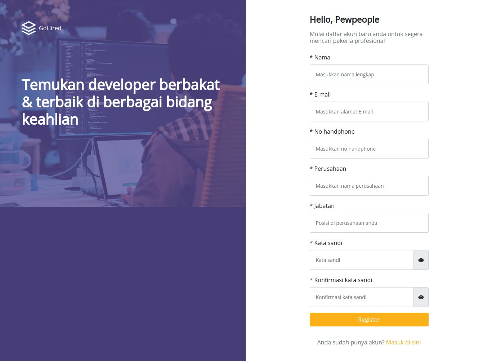
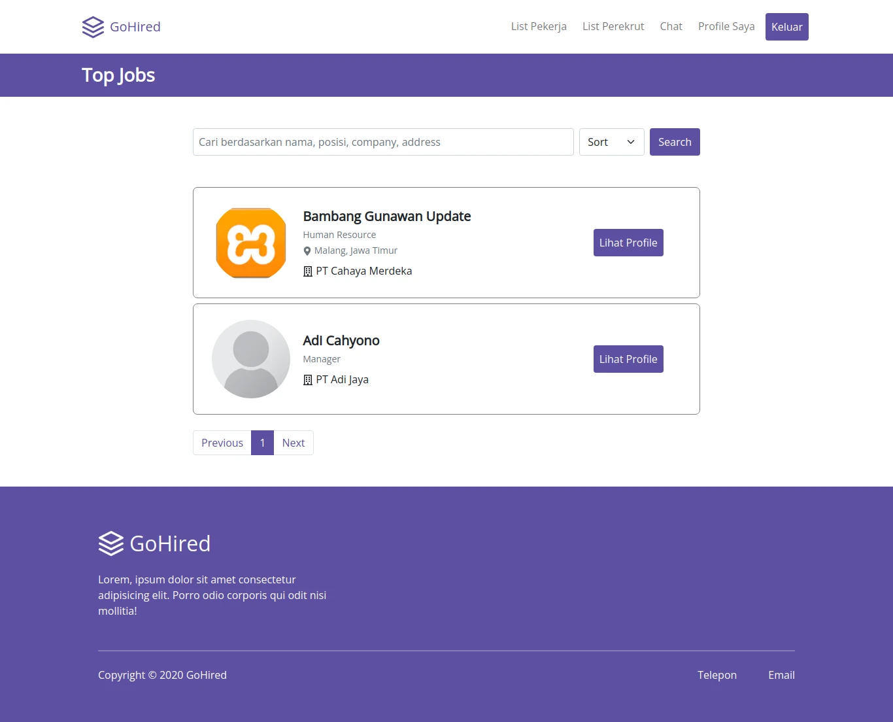
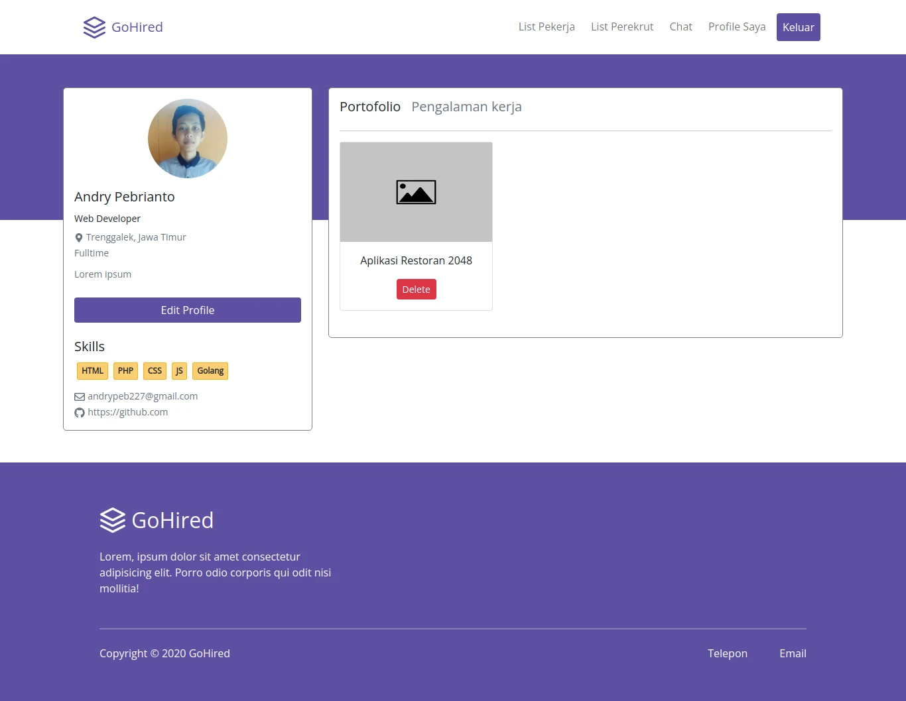
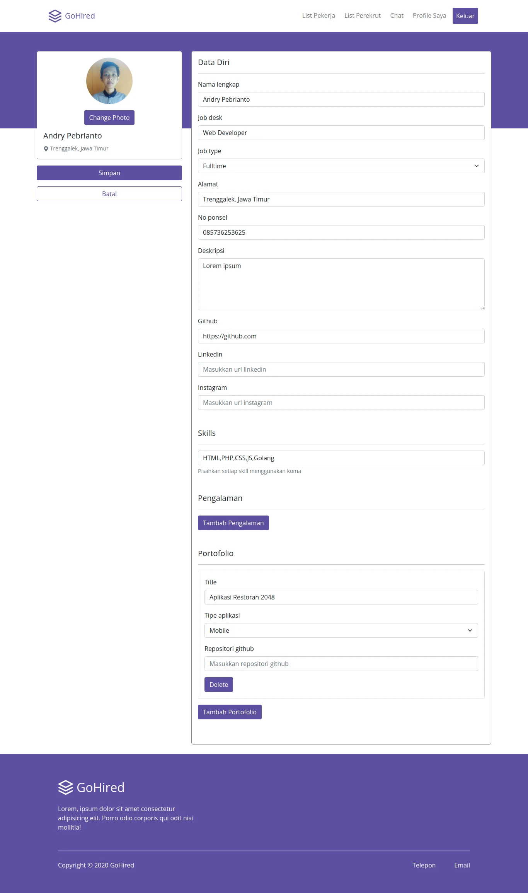
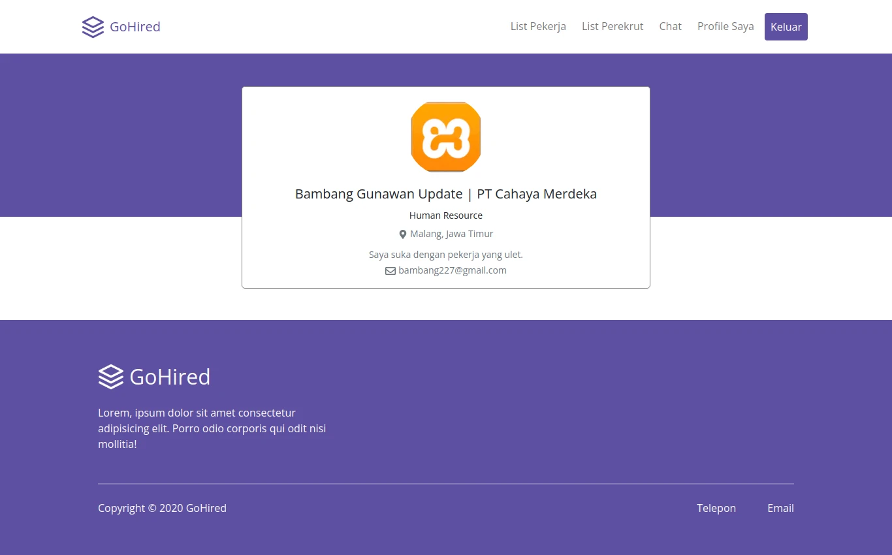
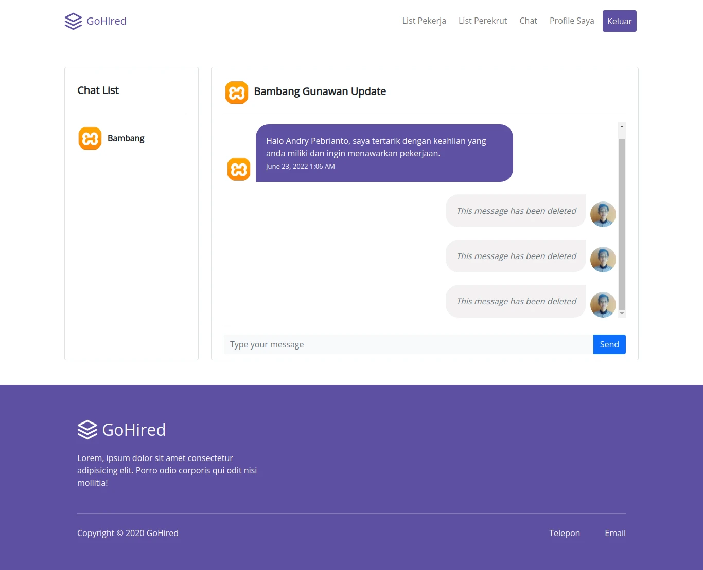

<div align="center">
  
</div>
<h3 align="center">GoHired</h3>
<p align="center">
  <a href="https://gohired.vercel.app/">View Demo</a>
  ·
  <a href="https://github.com/andry-pebrianto/gohired-client/issues">Report Bug</a>
</p>

<!-- ABOUT THE PROJECT -->
## About The Project

GoHired is a web chat application to search for workers and/or jobs with the features of registering, logging in, forgot password, recruiting workers, and realtime chat. This web application is built using ReactJS, ExpressJS, PostgreSQL, and WebSocket.

### Technology Used
- [NextJS](https://nextjs.org/)
- [Redux](https://redux.js.org/)
- [Bootstrap](https://getbootstrap.com/)
- [Socket.IO](https://socket.io/)
- [Moment](https://momentjs.com/)
- [Axios](https://github.com/axios/axios)

<!-- GETTING STARTED -->
## Getting Started

### Installation
- Clone This Repository

`git clone https://github.com/andry-pebrianto/gohired-client.git`

- Install Module

`npm install`

- Setting .env.local

```bash
NEXT_PUBLIC_APP_NAME=YOUR_APP_NAME
NEXT_PUBLIC_NODE_ENV=YOUR_CURRENT_ENVIRONMENT
NEXT_PUBLIC_API_URL=YOUR_API_URL
```

### Executing program

- Run this project with `npm run start`.

<!-- SCREENSHOT -->
## Screenshot

### Login


### Register Worker


### Register Recruiter


### Landing


### List Worker


### List Recruiter


### Worker Profile


### Edit Profile


### Recruiter Profile


### Chat


<!-- RELATED PROJECT -->
## Related Project

- [GoHired API](https://github.com/andry-pebrianto/gohired-api)
- [GoHired Demo](https://gohired.vercel.app/)

<!-- CONTACT INFO -->
## Contact Info

Contributors names and contact info:

1. Andry Pebrianto

- [Linkedin](https://www.linkedin.com/in/andry-pebrianto)

## License

This project is licensed under the MIT License - see the LICENSE file for details
